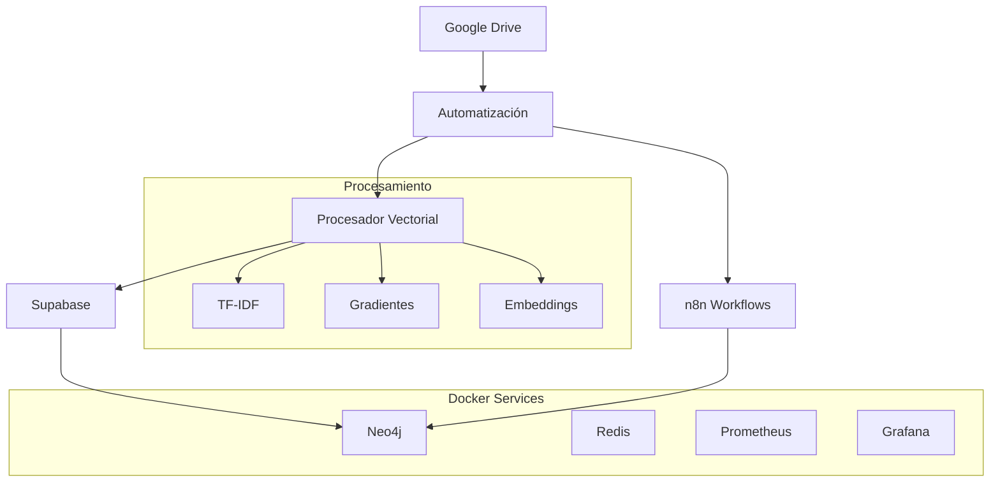

# 🧠 Sistema YO Estructural - Automatización Completa v3.0

## 📋 Descripción General

Este sistema automatiza completamente el flujo de procesamiento fenomenológico desde Google Drive hasta Neo4j, integrando:

- **Google Drive**: Monitoreo automático de archivos
- **Procesamiento Vectorial**: Análisis TF-IDF y gradientes fenomenológicos
- **Supabase**: Almacenamiento de datos procesados
- **n8n**: Orquestación de workflows
- **Neo4j**: Visualización y análisis de grafos
- **Docker**: Containerización y despliegue

## 🚀 Inicio Rápido

### 1. Configuración Automática

```bash
# Ejecutar el configurador automático
python setup_automatizacion.py
```

Este script:
- ✅ Verifica dependencias
- ✅ Configura variables de entorno
- ✅ Inicializa servicios Docker
- ✅ Prueba conexiones
- ✅ Inicia automatización

### 2. Configuración Manual

#### Instalar Dependencias
```bash
pip install -r requirements.txt
```

#### Configurar Variables de Entorno
Editar `.env` con tus credenciales:

```env
# NEO4J
NEO4J_URI=bolt://172.23.111.142:7687
NEO4J_USER=neo4j
NEO4J_PASSWORD=tu_password

# SUPABASE
SUPABASE_URL=https://tu-proyecto.supabase.co
SUPABASE_KEY=tu_supabase_key
SUPABASE_SERVICE_KEY=tu_service_key

# N8N (Render)
N8N_WEBHOOK_URL=https://tu-n8n.render.com/webhook/fenomenologia
N8N_API_KEY=tu_api_key
N8N_BASE_URL=https://tu-n8n.render.com

# GOOGLE DRIVE
GOOGLE_DRIVE_MONITORED_FOLDERS=folder_id_1,folder_id_2

# AUTOMATIZACIÓN
ENABLE_DRIVE_MONITOR=true
ENABLE_AUTO_PROCESSING=true
ENABLE_NEO4J_SYNC=true
```

#### Iniciar Servicios Docker
```bash
docker-compose up -d
```

#### Ejecutar Automatización
```bash
python automatizacion_completa.py
```

## 🏗️ Arquitectura del Sistema



## 📁 Estructura de Archivos

```
YO estructural/
├── 🔧 Configuración
│   ├── .env                          # Variables de entorno
│   ├── docker-compose.yml            # Servicios Docker
│   ├── configuracion/config.yaml     # Configuración del sistema
│   └── requirements.txt              # Dependencias Python
│
├── 🤖 Automatización
│   ├── automatizacion_completa.py    # Sistema principal
│   ├── procesamiento_vectorial.py    # Procesador ML
│   └── setup_automatizacion.py       # Configurador automático
│
├── 🔗 Integraciones
│   ├── google_drive_connector.py     # Conector Google Drive
│   ├── supabase_connector.py         # Conector Supabase
│   ├── n8n_config.py                 # Integración n8n
│   └── automatizacion_principal.py   # Sistema base
│
├── 🧠 Procesamiento
│   ├── analizador_textos/             # Análisis fenomenológico
│   ├── procesado/                     # Datos procesados
│   └── logs_sistema/                  # Logs del sistema
│
└── 🐳 Docker
    ├── Dockerfile                     # Imagen principal
    ├── Dockerfile.automation          # Imagen automatización
    └── start_automation.sh            # Script de inicio
```

## 🔄 Flujo de Procesamiento

### 1. Detección de Archivos
- Monitoreo continuo de carpetas en Google Drive
- Detección de archivos nuevos o modificados
- Descarga y análisis de metadatos

### 2. Procesamiento Vectorial
```python
# Extracción de vectores TF-IDF
vectores = procesador.extraer_vectores_texto(contenido)

# Cálculo de gradientes fenomenológicos
gradientes = procesador.calcular_gradientes_fenomenologicos(datos)

# Análisis de similitudes
similitudes = procesador.calcular_similitudes(vectores)
```

### 3. Almacenamiento
- **Supabase**: Datos estructurados y metadatos
- **Neo4j**: Grafos y relaciones fenomenológicas

### 4. Orquestación n8n
- Workflows automatizados
- Procesamiento avanzado
- Notificaciones y alertas

## 🛠️ Comandos Útiles

### Docker
```bash
# Iniciar todos los servicios
docker-compose up -d

# Ver logs en tiempo real
docker-compose logs -f

# Reiniciar un servicio específico
docker-compose restart yo_estructural_api

# Detener todos los servicios
docker-compose down

# Limpiar volúmenes
docker-compose down -v
```

### Automatización
```bash
# Ejecutar automatización completa
python automatizacion_completa.py

# Solo procesamiento vectorial
python procesamiento_vectorial.py

# Configuración interactiva
python setup_automatizacion.py

# Verificar estado del sistema
python -c "from automatizacion_completa import AutomatizacionCompletaYO; print(AutomatizacionCompletaYO().obtener_estado_sistema())"
```

### Monitoreo
```bash
# Ver logs de automatización
tail -f logs_sistema/automatizacion_completa.log

# Estado de contenedores
docker ps

# Uso de recursos
docker stats
```

## 📊 Monitoreo y Visualización

### Servicios Disponibles
- **Neo4j Browser**: http://localhost:7474
- **Grafana Dashboard**: http://localhost:3000
- **Prometheus Metrics**: http://localhost:9090
- **API Health**: http://localhost:8000/health

### Métricas Clave
- Archivos procesados por hora
- Tiempo de procesamiento promedio
- Errores y reintentos
- Uso de memoria y CPU
- Conexiones a servicios externos

## 🔧 Configuración Avanzada

### Variables de Entorno Adicionales
```env
# Procesamiento
PROCESSING_TIMEOUT=300
MAX_FEATURES_TFIDF=3000
BATCH_SIZE=100

# Monitoreo
MONITOR_INTERVAL=30
HEALTH_CHECK_INTERVAL=60

# Cache
ENABLE_REDIS_CACHE=true
CACHE_TTL=3600

# Logging
LOG_LEVEL=INFO
LOG_ROTATION=true
MAX_LOG_SIZE=100MB
```

### Configuración de Google Drive
1. Crear proyecto en Google Cloud Console
2. Habilitar Google Drive API
3. Crear credenciales OAuth 2.0
4. Descargar `credentials.json`
5. Ejecutar autenticación inicial

### Configuración de Supabase
1. Crear proyecto en Supabase
2. Configurar tablas necesarias:
   - `preinstancias`
   - `instancias`
   - `fenomenos`
   - `contextos`
3. Configurar RLS (Row Level Security)
4. Obtener claves API

### Configuración de n8n
1. Desplegar en Render o servidor propio
2. Crear workflows para:
   - Procesamiento de textos
   - Sincronización con Obsidian
   - Procesamiento multimedia
3. Configurar webhooks
4. Obtener API key

## 🐛 Solución de Problemas

### Errores Comunes

#### Error de Conexión a Neo4j
```bash
# Verificar que Neo4j esté corriendo
docker-compose ps neo4j

# Reiniciar Neo4j
docker-compose restart neo4j

# Verificar logs
docker-compose logs neo4j
```

#### Error de Autenticación Google Drive
```bash
# Eliminar token existente
rm token.json

# Ejecutar re-autenticación
python -c "from integraciones.google_drive_connector import GoogleDriveConnector; GoogleDriveConnector()"
```

#### Error de Conexión Supabase
- Verificar URL y claves en `.env`
- Comprobar conectividad de red
- Revisar configuración de CORS

#### Problemas de Memoria
```bash
# Aumentar memoria para Neo4j
# En docker-compose.yml:
NEO4J_dbms_memory_heap_max__size=4G

# Reiniciar servicios
docker-compose down && docker-compose up -d
```

### Logs Importantes
- `logs_sistema/automatizacion_completa.log`: Log principal
- `docker-compose logs neo4j`: Logs de Neo4j
- `docker-compose logs yo_estructural_api`: Logs de la API

## 🔄 Actualizaciones

### Actualizar el Sistema
```bash
# Detener servicios
docker-compose down

# Actualizar código
git pull origin main

# Actualizar dependencias
pip install -r requirements.txt --upgrade

# Reconstruir imágenes
docker-compose build

# Reiniciar servicios
docker-compose up -d
```

### Backup y Restauración
```bash
# Backup Neo4j
docker exec yo_estructural_neo4j neo4j-admin dump --database=neo4j --to=/backups/neo4j-backup.dump

# Backup Supabase (usar herramientas de Supabase)
# Backup configuración
cp .env .env.backup
cp docker-compose.yml docker-compose.yml.backup
```

## 📞 Soporte

### Información del Sistema
```bash
# Versión del sistema
python -c "print('YO Estructural v3.0')"

# Estado de servicios
docker-compose ps

# Información de recursos
docker system df
```

### Contacto
- **Documentación**: Este README
- **Logs**: `logs_sistema/`
- **Configuración**: `configuracion/config.yaml`

---

## 🎯 Próximas Características

- [ ] Interfaz web para monitoreo
- [ ] API REST completa
- [ ] Integración con más servicios de almacenamiento
- [ ] Procesamiento de audio y video
- [ ] Machine Learning avanzado
- [ ] Alertas inteligentes
- [ ] Dashboard personalizable

---

**¡El sistema YO Estructural está listo para automatizar tu procesamiento fenomenológico!** 🚀